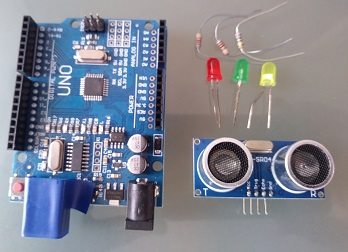
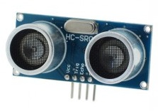
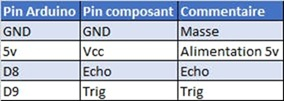
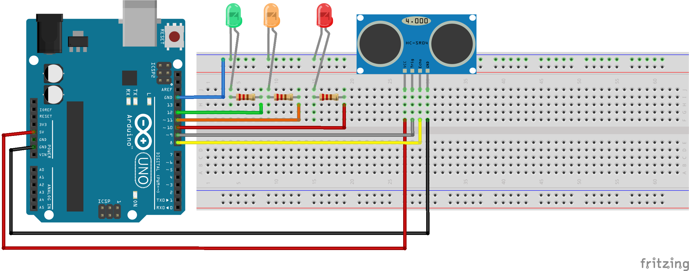

# Presence Detector

## Overview

First day with Arduino! 🎉  
Creating a presence detector:

- 🟢 Green: OK (no presence detected)  
- 🟠 Orange: presence within 20 cm  
- 🔴 Red: presence within 10 cm

My main goal is to create small projects and simple programs to **tinker with my children**.  
The idea is to learn together, in a fun way, while discovering electronics and programming.

---

## Required Components

- Arduino UNO or Genuino UNO × 1  
- **HC-SR04** ultrasonic sensor × 1  
- LEDs (green, orange, red)  
- Appropriate resistors  
- Breadboard and connection wires



---

## About This Project

I was looking for a simple but nice project to get started.  
The ultrasonic sensor immediately appealed to me, and I decided to make it the basis of my first Arduino project.

To implement it, I coupled it with LEDs:

- 🟠 Orange: an intruder is within 20 cm  
- 🔴 Red: an intruder is within 10 cm  
- 🟢 Green: my children suggested adding a green LED to signal that everything is fine

---

## Ultrasonic Sensor Connection

The **HC-SR04** sensor wiring is quite simple.  
My kit came with `.h` and `.cpp` files to retrieve sensor values.



### Sensor Mapping



---

## Arduino: C or C++?

Initially, I thought Arduino was programmed **exclusively in C language**.  
Upon discovering the `.cpp` files provided with the ultrasonic sensor, I realized that the Arduino environment actually uses **C++**.

This can be confusing because:

- Most Arduino examples look very much like **procedural C** (simple functions, no objects).  
- But as soon as you use libraries (for example `Ultrasonic`, `Servo`, `LiquidCrystal`), you exploit **object-oriented C++ classes**.  

👉 In practice, you can therefore program in **pure C** style (very basic) or take advantage of **C++** benefits (classes, objects, encapsulation) according to your needs.

---

## LEDs and Connections

I used the following Arduino pins:

- Red LED: pin 10  
- Orange LED: pin 11  
- Green LED: pin 12

---

## Circuit Diagram

To draw the assembly plan, I used **Fritzing** software.  
It's free software that allows you to easily represent breadboard assemblies.


---

## Using the `Ultrasonic` Class

My Arduino came with a dedicated class for manipulating the ultrasonic sensor.

- The constructor takes the `Trig` and `Echo` pins as parameters.  
- To get the distance in centimeters, you call the method:

```cpp
ultrasonic.Ranging(CM);
```

---

## My Arduino Program

To avoid flashing the green LED too often, I created a global variable that counts the number of cycles where everything is fine.  
The green LED only turns on every 10 loops (the test is performed every 200 ms).

When presence is detected:  
- The orange or red LED flashes 2 times (depending on distance).

Variables defining threshold distances:

```cpp
int warningDistance = 20;  // warning threshold in cm
int alertDistance   = 10;  // critical threshold in cm
```

### Main Loop

```cpp
void loop() {
  digitalWrite(okPlotId, LOW);
  digitalWrite(warningPlotId, LOW);
  digitalWrite(alertPlotId, LOW);

  int distanceInCm = ultrasonic.Ranging(CM);
  Serial.println(distanceInCm);

  if (distanceInCm <= warningDistance) {
    greenFlashLoopCount = 1;
    int ledId = warningPlotId;
    if (distanceInCm <= alertDistance) {
      ledId = alertPlotId;
    }
    flashLed(ledId);
  }
  else {
    if (greenFlashLoopCount % 10 == 0) {
      digitalWrite(okPlotId, HIGH);
      delay(200);
      greenFlashLoopCount = 1;
    }
    greenFlashLoopCount++;
  }
  delay(100);
}
```

### Utility Function to Flash an LED

```cpp
void flashLed(int ledId) {
  int digitalStatus;
  for (int i = 1; i < 5; i++) {
    if (i % 2 == 0) {
      digitalStatus = LOW;
    } else {
      digitalStatus = HIGH;
    }
    digitalWrite(ledId, digitalStatus);
    delay(200);
  }
}
```

---

## Conclusion

And there you have it!  
A simple, educational and fun little project to get started with Arduino.

**Enjoy it 😉**  