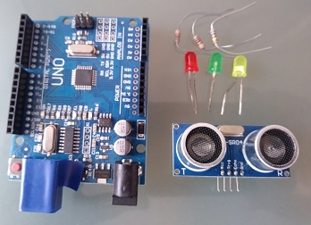
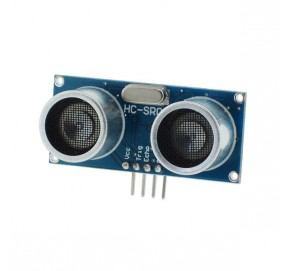
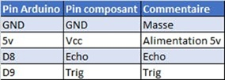
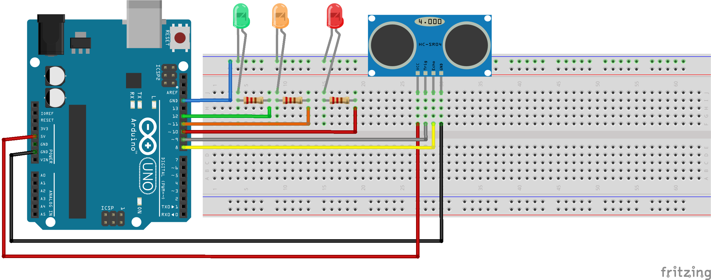

# Détecteur de présence

## Présentation

Premier jour avec Arduino ! 🎉  
Création d'un détecteur de présence :

- 🟢 Vert : OK (aucune présence détectée)  
- 🟠 Orange : présence à moins de 20 cm  
- 🔴 Rouge : présence à moins de 10 cm

Mon objectif principal est de réaliser de petits montages et des programmes simples pour **bricoler avec mes enfants**.  
L’idée est d’apprendre ensemble, de manière ludique, tout en découvrant l’électronique et la programmation.

---

## Composants nécessaires

- Arduino UNO ou Genuino UNO × 1  
- Capteur à ultrasons **HC-SR04** × 1  
- LEDs (verte, orange, rouge)  
- Résistances adaptées  
- Plaquette d’essai et câbles de connexion



---

## À propos de ce projet

Je cherchais un montage simple mais sympa pour débuter.  
Le capteur à ultrasons m’a tout de suite plu, et j’ai décidé d’en faire la base de mon premier projet Arduino.

Pour le mettre en œuvre, je l’ai couplé avec des LEDs :

- 🟠 Orange : un intrus est à moins de 20 cm  
- 🔴 Rouge : un intrus est à moins de 10 cm  
- 🟢 Vert : mes enfants m’ont suggéré d’ajouter une LED verte pour signaler que tout va bien

---

## Connexion du capteur ultrason

Le branchement du capteur **HC-SR04** est assez simple.  
Mon kit était fourni avec des fichiers `.h` et `.cpp` pour récupérer les valeurs du capteur.



### Mapping du capteur



---

## Arduino : C ou C++ ?

Au départ, je pensais que l’Arduino se programmait **exclusivement en langage C**.  
En découvrant les fichiers `.cpp` fournis avec le capteur ultrason, j’ai réalisé que l’environnement Arduino utilise en fait **le C++**.

Cela peut prêter à confusion, car :

- La majorité des exemples Arduino ressemblent beaucoup à du **C procédural** (fonctions simples, pas d’objets).  
- Mais dès qu’on utilise des bibliothèques (par exemple `Ultrasonic`, `Servo`, `LiquidCrystal`), on exploite des **classes C++ orientées objet**.  

👉 En pratique, on peut donc programmer en style **C pur** (très basique) ou tirer parti des avantages du **C++** (classes, objets, encapsulation) selon ses besoins.

---

## LEDs et branchements

J’ai utilisé les pins suivants de l’Arduino :

- LED rouge : pin 10  
- LED orange : pin 11  
- LED verte : pin 12

---

## Schéma du montage

Pour dessiner le plan de montage, j’ai utilisé le logiciel **Fritzing**.  
C’est un logiciel gratuit qui permet de représenter facilement les montages sur plaquettes d’essai.


---

## Utilisation de la classe `Ultrasonic`

Mon Arduino était livré avec une classe dédiée pour manipuler le capteur ultrason.

- Le constructeur prend en paramètre les pins `Trig` et `Echo`.  
- Pour récupérer la distance en centimètres, on appelle la méthode :

```cpp
ultrasonic.Ranging(CM);
```

---

## Mon programme Arduino

Pour éviter de faire clignoter trop souvent la LED verte, j’ai créé une variable globale qui compte le nombre de cycles où tout va bien.  
La LED verte s’allume seulement toutes les 10 boucles (le test est effectué toutes les 200 ms).

Lorsqu’une présence est détectée :  
- La LED orange ou rouge clignote 2 fois (selon la distance).

Variables définissant les distances seuils :

```cpp
int warningDistance = 20;  // seuil d'avertissement en cm
int alertDistance   = 10;  // seuil critique en cm
```

### Boucle principale

```cpp
void loop() {
  digitalWrite(okPlotId, LOW);
  digitalWrite(warningPlotId, LOW);
  digitalWrite(alertPlotId, LOW);

  int distanceInCm = ultrasonic.Ranging(CM);
  Serial.println(distanceInCm);

  if (distanceInCm <= warningDistance) {
    greenFlashLoopCount = 1;
    int ledId = warningPlotId;
    if (distanceInCm <= alertDistance) {
      ledId = alertPlotId;
    }
    flashLed(ledId);
  }
  else {
    if (greenFlashLoopCount % 10 == 0) {
      digitalWrite(okPlotId, HIGH);
      delay(200);
      greenFlashLoopCount = 1;
    }
    greenFlashLoopCount++;
  }
  delay(100);
}
```

### Fonction utilitaire pour faire clignoter une LED

```cpp
void flashLed(int ledId) {
  int digitalStatus;
  for (int i = 1; i < 5; i++) {
    if (i % 2 == 0) {
      digitalStatus = LOW;
    } else {
      digitalStatus = HIGH;
    }
    digitalWrite(ledId, digitalStatus);
    delay(200);
  }
}
```

---

## Conclusion

Et voilà !  
Un petit projet simple, pédagogique et amusant pour débuter avec Arduino.

**Enjoy it 😉**  
